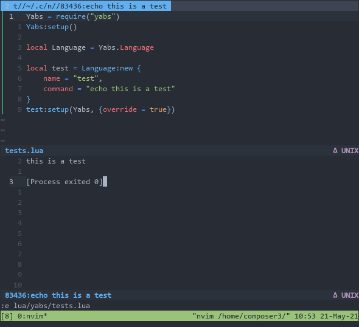
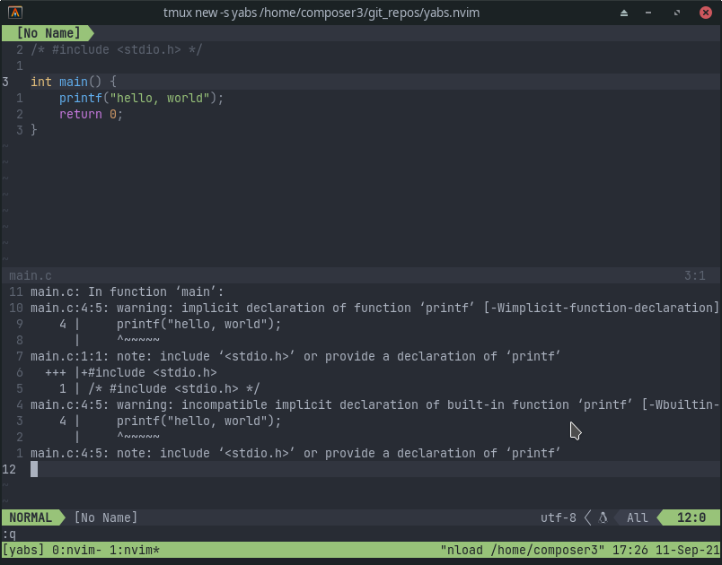
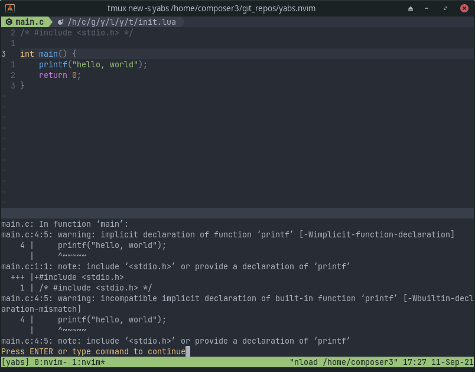
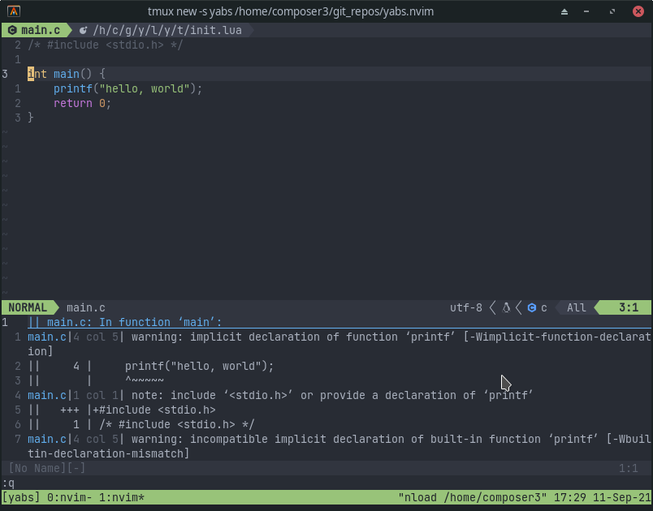
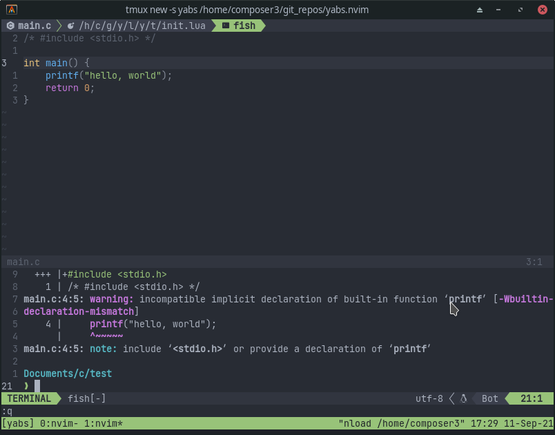

# yabs.nvim

Yet Another Build System for Neovim, written in lua.

<!--  -->

## About

yabs.nvim adds vscode-like tasks feature to neovim. It allows you to define specific commands that are associated with certain filetypes (or whole projects), as well as where the output for those commands should go, and execute them with a keybinding. For example, for a python file you could have a `run` task that runs `python3 %` in the terminal; for rust you could have a `build` task and a `run` task that executes `cargo build`, sending the output to the quickfix list, and `cargo run`, sending the output to the terminal, respectively; and for javascript, you could have a task to start the frontend server, one to start the backend server, and another one to run tests.

## Installation

[packer.nvim](https://github.com/wbthomason/packer.nvim):

```lua
use {
  'pianocomposer321/yabs.nvim',
  requires = { 'nvim-lua/plenary.nvim' }
}
```

[vim-plug](https://github.com/junegunn/vim-plug):

```lua
Plug 'nvim-lua/plenary.nvim'`
Plug 'pianocomposer321/yabs.nvim'`
```

## Setup

```lua
require('yabs'):setup({
  languages = { -- List of languages in vim's `filetype` format
    lua = {
      tasks = {
        run = {
          command = 'luafile %', -- The command to run (% and other
          -- wildcards will be automatically
          -- expanded)
          type = 'vim',  -- The type of command (can be `vim`, `lua`, or
          -- `shell`, default `shell`)
        },
      },
    },
    c = {
      default_task = 'build_and_run',
      tasks = {
        build = {
          command = 'gcc main.c -o main',
          output = 'quickfix', -- Where to show output of the
          -- command. Can be `buffer`,
          -- `consolation`, `echo`,
          -- `quickfix`, `terminal`, or `none`
          opts = { -- Options for output (currently, there's only
            -- `open_on_run`, which defines the behavior
            -- for the quickfix list opening) (can be
            -- `never`, `always`, or `auto`, the default)
            open_on_run = 'always',
          },
        },
        run = { -- You can specify as many tasks as you want per
          -- filetype
          command = './main',
          output = 'consolation',
        },
        build_and_run = { -- Setting the type to lua means the command
          -- is a lua function
          command = function()
            -- The following api can be used to run a task when a
            -- previous one finishes
            -- WARNING: this api is experimental and subject to
            -- changes
            require('yabs'):run_task('build', {
              -- Job here is a plenary.job object that represents
              -- the finished task, read more about it here:
              -- https://github.com/nvim-lua/plenary.nvim#plenaryjob
              on_exit = function(Job, exit_code)
                -- The parameters `Job` and `exit_code` are optional,
                -- you can omit extra arguments or
                -- skip some of them using _ for the name
                if exit_code == 0 then
                  require('yabs').languages.c:run_task('run')
                end
              end,
            })
          end,
          type = 'lua',
        },
      },
    },
  },
  tasks = { -- Same values as `language.tasks`, but global
    build = {
      command = 'echo building project...',
      output = 'consolation',
    },
    run = {
      command = 'echo running project...',
      output = 'echo',
    },
    optional = {
      command = 'echo runs on condition',
      -- You can specify a condition which determines whether to enable a
      -- specific task (it could be your custom function)
      condition = require('yabs.conditions').file_exists('filename.txt'),
    },
  },
  opts = { -- Same values as `language.opts`
    output_types = {
      quickfix = {
        open_on_run = 'always',
      },
    },
  },
})
```

## Usage

```lua
local yabs = require('yabs')

-- runs the task `build` for the current language, falling back to a global
-- task with that name if it is not found for the current language
yabs:run_task('build')

-- runs the task that is specified as the default (see configuration section
-- above), or the first one if not specified
yabs:run_default_task()

-- Run command `echo hello, world` directly. Output is specified by the second
-- argument (same possible values as `output` option for tasks above), and
-- additional arguments are defined with the third argument (same as
-- `task.opts` above)
yabs.run_command('echo hello, world', 'quickfix', { open_on_run = 'always' })
```

### `.yabs` files

You can create project-local configurations by creating `.yabs` file
in the project working directory. It will be sourced as a lua file the
first time you execute `yabs:run_task()`. The file should return a
table with additional task that will be append to your global
configuration. The syntax is the same as for [setup()](#setup):

```lua
return {
  languages = {
    python = {
      tasks = {
        run = {
          command = 'python %',
          type = 'quickfix',
        },
      },
    },
  },
  tasks = {
    build = {
      command = 'cargo build',
      output = 'consolation',
    },
  }
}
```

## Telescope integration

You can execute tasks from Telescope by running `:Telescope yabs tasks` / `:Telescope yabs current_language_tasks` or `:Telescope yabs global_tasks`.

If you use the telescope integration, it is recommended to add `require('telescope').load_extension('yabs')` to your configuraiton in order to have command completion.

## Advanced configuration

The `language.command` option in `yabs:setup()` can be either a string or a function that returns a string. Defining a function can be useful for more advanced commands.

Likewise, the `language.output` option can be one of the included types (`buffer`, `consolation`, `echo`, `quickfix`, `terminal`, or `none`), or a function accepting one argument - the command to run. For example, if you are using tmux, you could write a function to send the command to a tmux pane.

### Chaining tasks

You can set a task to run when a previous one is finished by setting the `on_exit`
value of the `opts` table in `yabs:run_task()`. This API is experimental and
subject to change, and is not recommended to be used in normal configurations.

## Screenshots

<details>
<summary>Buffer</summary>



</details>

<details>
<summary>Echo</summary>



</details>

<details>
<summary>Quickfix</summary>



</details>

<details>
<summary>Terminal</summary>



</details>
<!--  -->
